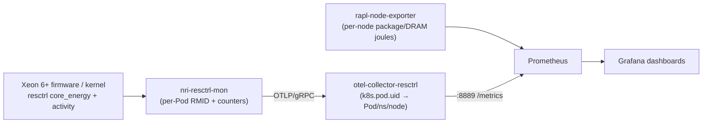

# Intel® Cloud Service: Create Kubernetes Cluster with Intel® Xeon 6+ and AET

This guide walks you through standing up a single-node Kubernetes cluster on
[Intel® Cloud Services](https://cloud.intel.com) using a bare-metal Intel®
Xeon® 6+ processor, and observing the **power and energy consumed by every
Kubernetes Pod** in real time on a Grafana dashboard.

The measurements come from **Intel® Application Energy Telemetry (AET)** — a
hardware feature of Intel Xeon 6+ (code name Clearwater Forest, and newer) that
exposes per-hardware-thread energy and performance counters through the Linux
`resctrl` filesystem. AET
lets you attribute CPU energy directly to the workload that consumed it, with
no software estimation model and no external power meter. This guide turns that
capability into a self-service demo anyone can reproduce on Intel Cloud
Services.

> **What you get at the end:** a working k3s cluster where two pre-built Grafana
> dashboards — *Kubernetes Pod Energy (Intel AET / resctrl-mon)* and
> *Kubernetes Pod Perf Counters (Intel AET / resctrl-mon)* — show live joules,
> watts, and micro-architectural counters (retired micro-ops, cycles, cache
> stalls) for each running Pod.

> **Where do you start?** This guide meets you wherever your hardware is today.
> If you need a node, **(A) Intel® Cloud Services** requests a bare-metal Xeon 6+
> allocation with a clean Ubuntu 26.04 image and jump-host SSH (the default), or
> **(B) your own bare-metal node** can be re-imaged in place to a clean Ubuntu
> 26.04. If you **already have a Clearwater Forest (or newer) node** you want to
> keep as-is, you skip the provisioning entirely and join the pipeline at the
> kernel build — or, if it already runs an AET-enabled kernel, at the telemetry
> deploy. The [Where do you start?](#where-do-you-start) matrix routes every case
> to its first step.

## What is AET and why it matters

Traditional per-workload energy figures on servers are *estimated* — software
apportions a node's total power to processes using heuristics. AET removes the
guesswork: the Xeon 6+ platform accumulates real energy (`core_energy`) and
activity counters per hardware thread and exposes them through `resctrl`. By
assigning each Kubernetes Pod its own resctrl monitoring group (RMID), we read
**measured** energy for that Pod directly from the silicon.

This is the differentiating value of Intel Xeon 6+: accurate, per-workload
energy accounting that customers can use to right-size deployments, bill by
actual energy, and drive sustainability goals.

### Data flow



| Component | Role |
|-----------|------|
| `nri-resctrl-mon` | NRI plugin DaemonSet. Creates a resctrl `mon_group` per Pod, assigns the RMID, reads `mon_PERF_PKG_*/{core_energy,activity,…}` and pushes per-Pod counters over OTLP/gRPC. |
| `otel-collector-resctrl` | OTLP sink. Resolves `k8s.pod.uid` → namespace/pod/node and re-exports the series for Prometheus to scrape. |
| `rapl-node-exporter` | Per-node RAPL package/DRAM energy (`node_rapl_*_joules_total`) as an independent, node-level reference. |
| Prometheus | Scrapes the collectors and stores the time series. |
| Grafana | Renders the two AET dashboards. |

## Goals

By the end of this guide you will have:

1. Requested and accessed an Intel Xeon 6+ allocation on Intel Cloud Services.
2. Rebuilt the node's own Ubuntu kernel with AET (`resctrl`) support enabled.
3. Provisioned the node with that kernel and a full k3s stack.
4. Deployed the AET telemetry pipeline (`nri-resctrl-mon` →
   `otel-collector-resctrl` → Prometheus → Grafana).
5. Validated live per-Pod energy telemetry and viewed it in Grafana.
6. Deployed your own workloads and watched their energy and performance
   counters in real time.

> **Scope.** This guide covers *observability* — measuring and visualizing
> per-Pod energy.

### The toolkit

The steps below are automated by a small, inventory-driven set of scripts under
`cluster/` in this repository. You describe your allocation once in
`cluster/inventory.env` (the node's SSH alias, kernel, and Grafana settings) and
the numbered scripts do the rest. Every command in this guide can also be run by
hand if you prefer to understand each step.

| Script | Stage | Runs on |
|--------|-------|---------|
| `cluster/10-baremetal-provision.sh` | *(Alternate Stage 1, bare metal)* Re-image a self-managed node to clean Ubuntu 26.04 | workstation → node |
| `cluster/01-ssh-config.sh` | Generate / check / retire the node's SSH stanza | workstation |
| `cluster/00-probe.sh` | Probe the allocation (read-only) | workstation |
| `cluster/05-proxy-setup.sh` | (Optional) Configure a corporate proxy | workstation |
| `cluster/20-kernel-build.sh` | Build the AET kernel package (`.deb` or `.rpm`) | build host (Docker) |
| `cluster/21-kernel-install.sh` | Install + promote the kernel on the node (deb: update-grub; rpm: grubby) | workstation → node |
| `cluster/30-k3s-up.sh` | Stand up the k3s cluster | workstation → node |
| `cluster/40-deploy-telemetry.sh` | Deploy the AET telemetry stack | workstation → node |
| `cluster/60-validate.sh` | Validate AET telemetry | workstation → node |
| `cluster/70-grafana-tunnel.sh` | Publish Grafana over an SSH tunnel + TLS proxy | workstation / publish host |

### Deploy with an AI assistant

You do not have to work through this alone. The repository ships two companion
documents that let a generative-AI coding assistant (GitHub Copilot, Claude,
etc.) walk you through the entire deployment, one verifiable step at a time —
useful even if you have never touched Kubernetes, SSH, or kernel
builds. Point your assistant at them at the start of a session:

| File | Audience | What it provides |
|------|----------|------------------|
| [AGENT.md](AGENT.md) | the AI assistant | The mental model, the ordered stage table, a "run then verify" working style, the safety rules (gated reboots, boot-default ordering, bare-metal Xeon 6+ requirement, no unapproved pushes), and a backward-diagnosis troubleshooting playbook. |
| [SKILLS.md](SKILLS.md) | the AI assistant | Eleven discrete deployment skills — from requesting the allocation through cleanup — each with *when to use*, preconditions, the exact toolkit commands, success criteria, and common failures. |

A typical prompt is simply *"Read AGENT.md and SKILLS.md, then help me deploy
this demo — start with Skill 1."* The assistant uses this human-facing README
and the `cluster/` scripts as the underlying source of truth; `AGENT.md` and
`SKILLS.md` just teach it how to drive them safely on your behalf.

Early on it will ask you to paste the output of your instance's **How to Connect
via SSH** panel (the **Linux / macOS** option). That one paste carries every
connection value it needs — proxy, jump host, node IP, login user — so you never
have to describe your allocation from memory.

## Prerequisites

A Linux host you control — this is your **workstation / control host**. It can
be an Ubuntu workstation, a Linux VM, or WSL on a laptop. It drives the whole
setup over SSH; it does **not** need to be a Xeon 6+ machine. On it you need:

- `ssh` and `git`
- `docker` (used to build the AET kernel package in a container)
- Outbound internet access (to reach Intel Cloud Services and pull public
  container images and kernel sources) — if your workstation sits behind a
  corporate HTTP/SOCKS proxy, see
  [Working behind a corporate firewall](#working-behind-a-corporate-firewall-http--socks-proxy)
  below before you start
- An account on [Intel® Cloud Services](https://cloud.intel.com) with the
  ability to request a bare-metal Intel Xeon 6+ allocation

`kubectl` is optional on the workstation — the tooling drives the cluster
through `k3s kubectl` on the server node over SSH, so nothing is installed on
your laptop besides the items above.

**For the bare-metal path (B)** you additionally need: root SSH access to your
Clearwater Forest node; an **out-of-band recovery path** (serial console / BMC /
KVM / physical access) because the re-image erases the node's disk; **Secure
Boot disabled** in firmware (the rebuilt AET kernel is unsigned); and the node
able to reach this workstation over HTTP (default port `8099`) to fetch the
installer ISO and autoinstall seed. `curl` and either `bsdtar` (`libarchive`) or
`7z` on the workstation make ISO extraction rootless.

## Where do you start?

The demo needs one thing to be true before the telemetry means anything: the
node is a **bare-metal Intel Xeon 6+ (Clearwater Forest or newer)** running a
kernel with **AET (`CONFIG_X86_CPU_RESCTRL_INTEL_AET`) enabled and booted with
`rdt=perf`**. Everything below is just how you get there from where you are now.
Find your row, set `PROVISION_MODE` / `KERNEL_SOURCE` / `KERNEL_PKG` in
`cluster/inventory.env` as shown, and begin at the listed step.

| Your situation | `PROVISION_MODE` | Kernel settings | Start at |
|----------------|------------------|-----------------|----------|
| **No node yet** — want one provisioned for you | `icloud` | `KERNEL_SOURCE=ubuntu`, `KERNEL_PKG=auto` | [Request an allocation](#request-an-allocation-from-intel-cloud-services) (Skill 1) |
| **Own a CWF node, OK to wipe it** — re-image to clean Ubuntu 26.04 | `baremetal` | `KERNEL_SOURCE=ubuntu`, `KERNEL_PKG=auto` | [Alternative start: re-image](#alternative-start-re-image-a-self-managed-bare-metal-node) (Skill 1-BM) |
| **Own an Ubuntu CWF node, keep the OS** — just needs an AET kernel | `icloud` *(no Stage 1)* | `KERNEL_SOURCE=ubuntu`, `KERNEL_PKG=auto` | [Build a Linux kernel](#build-a-linux-kernel-with-aet-support) (Skill 3) |
| **Own a non-Ubuntu CWF node (RHEL/Rocky/Fedora), keep the OS** — needs an AET kernel | `icloud` *(no Stage 1)* | `KERNEL_SOURCE=git`, `KERNEL_PKG=rpm`, `KERNEL_BRANCH=`*(AET tag)* | [Build a Linux kernel](#build-a-linux-kernel-with-aet-support) (Skill 3) → install/promote (Skill 4) |
| **Node ALREADY runs an AET kernel** (any distro) | `icloud` *(no Stage 1)* | *(kernel stages skipped)* | [Confirm AET](#provision-the-allocated-node), then k3s (Skill 5 → 6) |

For the three "keep the OS" rows you are **bringing your own node**: there is no
separate provisioning mode for it. Leave `PROVISION_MODE=icloud`, do **not** run
the Stage 1 request/allocate or re-image scripts, and instead fill in the
direct-SSH block of `cluster/inventory.env` (`NODE_JUMPS=('')`, your real login
user and node IP) so every later stage reaches the node directly. Then jump to
the "Start at" step above and follow the rest of the guide unchanged.

> **Non-Ubuntu nodes build from mainline.** A RHEL/Rocky/Fedora node has no
> Ubuntu `linux` source package to rebuild, so its AET kernel comes from a
> mainline tag (`KERNEL_SOURCE=git`, `KERNEL_BRANCH` set to a tag that carries
> the AET resctrl code) packaged as an `.rpm` (`KERNEL_PKG=rpm`). The `.rpm`
> build runs in a Rocky Linux container, so your build host still only needs
> Docker — no rpm tooling. `21-kernel-install.sh` then installs and promotes the
> kernel with `grubby` + `grub2-reboot` instead of `update-grub`. Everything
> from k3s onward is identical to the Ubuntu path.

## Choose your starting path

| | **(A) Intel® Cloud Services** | **(B) Self-managed bare metal** |
|-|-------------------------------|---------------------------------|
| Who | You want a node provisioned for you | You already have root on a CWF node |
| Node OS to start | Provisioned clean Ubuntu 26.04 | *Whatever it runs now* — re-imaged clean |
| SSH | Jump host + `ssh-copy-id` | Direct, key injected by autoinstall |
| `PROVISION_MODE` | `icloud` (default) | `baremetal` |
| Stage 1 | *Request an allocation* (below) | *Alternative start: re-image a self-managed bare-metal node* |
| Converges at | \— **Build a Linux kernel with AET support** — both paths continue identically from there \— | |

Set `PROVISION_MODE` in `cluster/inventory.env` accordingly. If you are on Intel
Cloud Services, continue with the sections below (configure the proxy if needed,
then request an allocation). If you own the node, skip to
[Alternative start](#alternative-start-re-image-a-self-managed-bare-metal-node).

## Working behind a corporate firewall (HTTP / SOCKS proxy)

If your workstation only reaches the internet through a corporate HTTP/SOCKS
proxy (and often can't open outbound SSH), every tool that fetches from outside
— `git`, `docker` (base-image pulls **and** in-container `apt`/`git`/Go), and
`ssh` to the cloud jump host — has to be told about that proxy. Rather than
hand-editing systemd drop-ins, `~/.docker/config.json`, and `~/.ssh/config`, you
state the proxy **once** in `cluster/inventory.env` and let
`cluster/05-proxy-setup.sh` apply it. Skip this section entirely if you have
direct outbound internet.

Set the `PROXY_*` variables (a commented block is in `inventory.env.example`):

```bash
PROXY_URL=http://proxy.example.com:912      # http_proxy AND https_proxy
PROXY_JUMP_HOST=my-jump-host                 # ssh host the ProxyCommand attaches to
PROXY_SSH_TYPE=http                          # or socks5
PROXY_CA=/etc/ssl/certs/your-corp-root-ca.pem  # only if the proxy re-signs TLS
# PROXY_NO_PROXY=...  PROXY_SSH_HOSTPORT=...  PROXY_GOPROXY=...   # optional overrides
```

> **On the Intel network,** the portal's **How to Connect via SSH** panel
> (Linux / macOS) prints the SOCKS form of exactly this — `ProxyCommand
> /usr/bin/nc -x proxy-dmz.intel.com:1080 %h %p` for `146.152.*`, `192.55.48.*`,
> and `134.191.*`. To have the toolkit generate the equivalent stanza for you,
> set `PROXY_SSH_TYPE=socks5` and `PROXY_SSH_HOSTPORT=proxy-dmz.intel.com:1080`;
> an HTTP-CONNECT proxy works too (`PROXY_SSH_TYPE=http`).

Then, from `cluster/`:

```bash
./05-proxy-setup.sh docker        # Docker daemon drop-in + client build proxy
./05-proxy-setup.sh ssh apply     # add the jump-host ProxyCommand to ~/.ssh/config
eval "$(./05-proxy-setup.sh env)" # export http(s)_proxy / no_proxy / CA into this shell
./05-proxy-setup.sh check         # verify git, docker, and ssh reach the outside
# or just: ./05-proxy-setup.sh all   (docker + ssh apply + check)
```

The script derives a `no_proxy` that already covers loopback and the private and
k3s pod/service CIDRs, so SSH tunnels and in-cluster scrapes never get bounced
to the proxy. If a clone still can't get out even through the proxy, clone the
kernel elsewhere and set `KERNEL_LOCAL_REPO` in `inventory.env` —
`20-kernel-build.sh` serves it locally to the build container
(see the *Build a Linux kernel* section).

> **In-cluster queries already bypass the proxy.** The toolkit's Prometheus
> queries (`60-validate.sh`, etc.) use `curl --noproxy '*'`, so a stray
> `http_proxy` won't break them.


## Request an allocation from Intel® Cloud Services

The console lives at [cloud.intel.com](https://cloud.intel.com). Its top tabs
(and the left **Cloud Services** menu) are **Overview**, **Catalog** (the
hardware catalog), **Instances**, and **SSH keys**. The active region is encoded
in the console URL (`…/preview/compute?region=<region>`, e.g. `us-region-3`).
SSH public keys live under **SSH keys** and are stored separately from any other
keys. The **Instances** tab lists your nodes with columns **Instance Name**,
**IP**, **State**, **Instance Type**, **Reservation Start**, **Reservation
End**, and per-row **Actions**: **Connect** (browser session), **SSH** (shows
the exact SSH command), **Edit** (change keys/settings), **Extend** (push out
the reservation expiration), and **Delete** (release the node). Bare-metal Xeon
6+ nodes appear with an instance type such as **`BM-CWF`** (Bare-Metal
Clearwater Forest). Clicking a node opens its **Details** page (tabs
**Details**, **Networking**, **Security**, **Billing**, plus **Connect**,
**How to Connect via SSH**, and an **Actions** menu); there, **Instance
Category: `BareMetalHost`** confirms you have a bare-metal node, **Instance
Type** reads *“Intel® Xeon® processors (codenamed Clear Water Forest)”*, and
**Machine Image** shows the stock OS (e.g. Ubuntu 26.04 LTS — deb-based, which
is why the toolkit’s default kernel path builds a `.deb`). The official guides
are
[How to Sign In](https://cloud.intel.com/docs/how_to_register.html),
[How to Request](https://cloud.intel.com/docs/how_to_request.html), and
[How to Access](https://cloud.intel.com/docs/how_to_access.html).

1. **Sign in or register.** Click **Sign In / Sign Up** (top-right) and sign in
   with a corporate or personal account via the Intel login page. New users
   verify their email and accept the Intel® Cloud Services license agreement.

2. **Create and upload your SSH key.** Generate a key pair on your workstation
   (do this first so the key is available when you request the instance), then
   upload the **public** key in the console under **SSH Keys → Upload key**
   (up to 20 keys; it can also be added directly in the request form):

   ```bash
   ssh-keygen -t ed25519 -C "intelcloud-aet" -f ~/.ssh/id_ed25519_intelcloud
   cat ~/.ssh/id_ed25519_intelcloud.pub   # paste this into the portal
   ```

3. **Request the instance.** Open the **Catalog** tab and choose a **bare-metal
   Intel Xeon 6+** instance (shown as an instance type like **`BM-CWF`**,
   Bare-Metal Clearwater Forest) — AET requires `resctrl` and RAPL sysfs,
   available only on bare metal (not a shared/virtual instance). Intel Xeon 6+
   (code name Clearwater Forest) exposes the AET `PERF_PKG` counters; earlier
   Xeon 6 parts do not. Once created, the instance **Details** page should show
   **Instance Category: `BareMetalHost`** — that field is your confirmation you
   got bare metal. In **Request a Cloud
   Instance**, fill the required fields (**Instance name**, **Intended use**,
   **Use case**, **Duration**, and a **Deployment details** description), select
   your **SSH Public Key(s)** so SSH access is enabled, optionally turn on
   **Termination Protection**, then click **Request Instance**. Request a single
   bare-metal node — this demo runs entirely on one Xeon 6+ instance.
4. **Wait for approval.** Approval arrives by email, typically within ~2–3
   business days (some requests are pre-approved and available immediately; Test
   Drive access is self-service). The email reports approved, waitlisted, or
   rejected.

5. **Get the exact SSH details and record access.** When the instance **State**
   shows **Ready** on the **Instances** tab, open the instance and click
   **How to Connect via SSH**, then select the **Linux / macOS** option — that
   panel is the authoritative source for every connection value. It gives you
   three things:

   - the **Intel SOCKS proxy** stanza to add to `~/.ssh/config` when you connect
     from inside the Intel network:

     ```
     Host 146.152.* 192.55.48.* 134.191.*
     ProxyCommand /usr/bin/nc -x proxy-dmz.intel.com:1080 %h %p
     ```

   - the **connection string**, naming the node user, the node IP, and the jump
     host:

     ```bash
     ssh-keygen -R 192.168.6.2 2>/dev/null; ssh -J guest@146.152.205.79 devcloud@192.168.6.2
     ```

   - the **default credentials** — username `devcloud`, password `devcloud`.

   The `ssh-keygen -R` prefix is not decoration: Intel Cloud recycles these
   private IPs between allocations, so a previous reservation's host key is
   often still in your `~/.ssh/known_hosts` and would fail verification. (The
   **Connect** action opens a browser/JupyterLab session instead; this demo
   needs real SSH.)

6. **Describe the allocation to the toolkit.** Copy
   `cluster/inventory.env.example` to `cluster/inventory.env` and fill in the
   node alias and the connection facts from step 5 (`NODE_HOSTS`, `NODE_JUMPS`,
   `NODE_USER`, `JUMP_USER`, `SSH_IDENTITY`, plus the `PROXY_*` block if you
   need the SOCKS stanza). Generate the `~/.ssh/config` stanza from that —
   don't hand-edit it:

   ```bash
   ./cluster/01-ssh-config.sh apply   # writes a managed block; backs up first
   ```

   Keeping the stanzas script-managed matters at both ends of an allocation: it
   is how you retire them later (`01-ssh-config.sh remove`), and stale stanzas
   from a previous reservation otherwise *shadow* the new ones — ssh takes the
   first matching `Host`, and a lapsed reservation shows up as an unanswerable
   jump-host password prompt.

7. **Swap the default password for your SSH key.** The panel in step 5 hands out
   a *password*; a freshly provisioned node has no authorized key at all. Every
   script in this toolkit runs non-interactively, so install your key once — on
   the jump host and on the node — and you will not see a prompt again:

   ```bash
   # jump host (usually already accepts the key you uploaded to the portal)
   ssh -o BatchMode=yes -o ConnectTimeout=10 guest@146.152.205.79 true \
     || ssh-copy-id -i ~/.ssh/id_ed25519_intelcloud.pub -o BatchMode=no guest@146.152.205.79

   # the node itself, through the jump host, via the alias you just generated
   ssh-copy-id -i ~/.ssh/id_ed25519_intelcloud.pub -o BatchMode=no icloud-aet0
   ```

   `-o BatchMode=no` is required because the generated stanza sets
   `BatchMode yes`, which otherwise suppresses the very password prompt you need
   here. Each command asks for the password once (`devcloud` by default) and
   appends your public key to the remote `~/.ssh/authorized_keys`.

   Then verify and retire the default password:

   ```bash
   ./cluster/01-ssh-config.sh check   # LIVE / STALE / UNREACHABLE per node
   ssh icloud-aet0 passwd             # replace the default 'devcloud' password
   ./cluster/00-probe.sh
   ```

   > **Uploading a key in the portal is not the same as installing it on the
   > node.** The portal key authorizes the *jump host*; the node needs the key in
   > its own `authorized_keys`. If the jump host authenticates but the node
   > answers `Permission denied (publickey,password)`, run the `ssh-copy-id`
   > above — the reservation is fine.

## Alternative start: re-image a self-managed bare-metal node

*Use this section instead of the allocation steps above when you already have
root on your own bare-metal Clearwater Forest node (`PROVISION_MODE=baremetal`).*
It re-images the node **in place** to a clean Ubuntu 26.04 and enables key-based
SSH — no BMC, PXE, or USB required. Everything from *Build a Linux kernel* onward
is then identical to the Intel Cloud path.

> **This ERASES the node's disk and takes it fully offline.** Only run it on a
> node you can afford to wipe, with an **out-of-band recovery path** (serial
> console / BMC / KVM / physical access) in hand. Confirm **Secure Boot is off**
> in firmware first — the rebuilt AET kernel is unsigned. This is not a shared or
> production box.

### How it works

The tooling kexecs the node's running OS straight into the **Ubuntu 26.04
live-server installer** (subiquity), driven unattended by a **NoCloud
autoinstall** seed served over HTTP from your workstation. The installer wipes
the target disk, installs a clean Ubuntu 26.04, creates your login user with the
SSH public key injected, enables `sshd`, applies the Intel-network proxy, and
returns the node at its original IP — the same clean starting state Intel Cloud
would hand you.

```
running OS on the node (root SSH)
  └─ kexec → Ubuntu 26.04 live-server installer (subiquity)
       └─ fetches ISO + NoCloud seed over HTTP from your workstation
          wipes the target disk, installs clean Ubuntu 26.04,
          injects your SSH key, enables sshd, preserves the node's IP
          └─ reboot → clean Ubuntu 26.04, key-based SSH
```

### Configure the inventory

Copy `cluster/inventory.env.example` to `cluster/inventory.env` and set the
bare-metal block (see the commented section there):

```bash
PROVISION_MODE=baremetal
NODES=(aet-baremetal0)
NODE_USER=<your-login-user>          # created by autoinstall (NOT devcloud)
NODE_HOSTS=(10.20.30.40)             # the node's real lab IP
NODE_JUMPS=('')                      # '' = direct route, no jump host
SSH_IDENTITY=~/.ssh/id_ed25519_intelcloud   # its .pub is injected as the node's key
UBUNTU_ISO_SHA256=<from the 26.04 release SHA256SUMS>
REIMAGE_HOSTNAME=aet-baremetal0
REIMAGE_TARGET_DISK=                 # empty = auto-detect on `capture`, then confirm
REIMAGE_NET=static                   # preserve the captured IP (or dhcp)
SEED_HTTP_BIND=                      # this workstation's lab-facing IP (empty = auto)
```

The `PROXY_*` block is reused unchanged on the Intel network. Generate the
(jump-less) SSH stanza from this with `./cluster/01-ssh-config.sh apply`.

### Run the re-image

From `cluster/`, walk the stages (each is idempotent; `reimage` is the only
destructive one and is gated behind `ALLOW_REIMAGE=1`):

```bash
./10-baremetal-provision.sh capture   # read the node's disk + network identity (read-only)
./10-baremetal-provision.sh fetch     # download + verify the 26.04 ISO, extract vmlinuz/initrd
./10-baremetal-provision.sh seed      # render the NoCloud autoinstall user-data + meta-data
./10-baremetal-provision.sh serve     # serve the ISO + seed over HTTP (background)
# confirm REIMAGE_TARGET_DISK + your recovery path, then:
ALLOW_REIMAGE=1 ./10-baremetal-provision.sh reimage   # kexec into the installer — WIPES the disk
./10-baremetal-provision.sh wait      # block until the node returns as clean Ubuntu 26.04
./10-baremetal-provision.sh serve-stop
```

`./10-baremetal-provision.sh all` runs `capture → fetch → seed → serve → reimage
→ wait` in one shot (still gated by `ALLOW_REIMAGE=1`).

When `wait` reports the node up on Ubuntu 26.04 with key SSH, verify with
`./00-probe.sh` and continue at **Build a Linux kernel with AET support** below —
the rest of the guide is identical. (The `ssh-copy-id` password-bootstrap of the
Intel Cloud path does not apply: autoinstall already installed your key.)

## Build a Linux kernel with AET support in resctrl

AET counters are surfaced by the Linux kernel's `resctrl` subsystem, and three
options have to be set for this demo:

| Option | Purpose | On the stock Ubuntu 26.04 kernel |
|--------|---------|----------------------------------|
| `CONFIG_X86_CPU_RESCTRL_INTEL_AET` | the AET `PERF_PKG` resctrl resource | **not enabled** |
| `CONFIG_INTEL_RAPL_TPMI` | node-level RAPL package/DRAM energy | already `=m` |
| `CONFIG_CGROUP_BPF` | container runtime plumbing | already `=y` |

So there is exactly **one** missing option. Intel Cloud's bare-metal Xeon 6+
image is Ubuntu 26.04 LTS, whose Linux v7.0 kernel already carries a complete
AET implementation — Canonical simply does not turn that option on in the
shipped config.

This stage therefore does not install a different kernel. It **rebuilds the very
same Ubuntu kernel, from Ubuntu's own source package, with that one option
enabled**:

- **Ubuntu's source, not mainline.** The build fetches Ubuntu's `linux` source
  package straight from the archive, so every Ubuntu patch is retained and the
  result stays inside Ubuntu 26.04 LTS's multi-year security-update commitment.
  By default it takes the archive's **current** version — the fully patched one.
  Ubuntu keeps only the newest `linux` source (superseded versions are removed),
  so your AET kernel is typically *newer* than the one the node shipped with,
  which is precisely the benefit of the security commitment.
- **No OS change.** The node already runs the target distro, so there is no
  upgrade, no release hop, and no kernel major-version jump.
- **The node's own config.** The build starts from the node's live
  `/boot/config-$(uname -r)`, so every boot, NIC, and NVMe driver it needs is
  preserved.
- **Docker for reproducibility.** The build runs in a container whose base image
  matches the node's Ubuntu series, so the toolchain is fixed and repeatable.
  Pin it by digest (`KERNEL_BUILD_IMAGE=ubuntu:26.04@sha256:...`) if you want
  bit-for-bit reproducibility.

> **When to use `KERNEL_SOURCE=git` instead.** The Ubuntu-source path above
> applies whenever the node runs Ubuntu 26.04 — which is every node this guide
> provisions — so it is the default and you should not deviate from it. The git
> path (`KERNEL_SOURCE=git` with `KERNEL_REPO`/`KERNEL_BRANCH`, e.g. a mainline
> `v7.0` tag) is **only** for a *different* base OS whose own kernel does not
> carry AET and therefore has no Ubuntu source to rebuild — for example an
> RPM-based image (`KERNEL_PKG=rpm`), for which a `kernel/rocky-build.Docker` is
> included and `21-kernel-install.sh` installs/promotes with `grubby`. Building
> a mainline tag on an Ubuntu 26.04 node is the wrong choice: the AET code is
> already in Ubuntu's v7.0 kernel, so going to mainline only forfeits Ubuntu's
> patches and its multi-year security-update commitment for no gain.

### Prerequisites for the Docker build

- `docker` on a build host (your workstation is fine)
- Outbound access to the Ubuntu archive (the container runs `apt-get source`)
- A reachable node — `capture` reads the node's stock config, Ubuntu series, and
  `linux` source version over SSH, so it cannot be done before the allocation is
  live

The kernel variables in `cluster/inventory.env` are already correct for an Intel
Cloud node: `KERNEL_SOURCE=ubuntu`. `capture` detects the node's Ubuntu series
(which selects the build image) and records the kernel version it currently runs.
Set `UBUNTU_KERNEL_VERSION` only to pin a particular source version — and note
that the archive serves just the current one, so pinning an older version needs
an archive snapshot such as `snapshot.ubuntu.com`.

> **`KERNEL_TAG` follows Ubuntu's upstream point release.** Ubuntu's source
> version and the kernel release are not the same thing: source `7.0.0-29.29` is
> upstream **v7.0.12**, so the build produces `7.0.12-aet`. That value moves each
> time Ubuntu ships a new point release, and the install step uses it to find the
> right GRUB entry — so `verify` prints the exact release and fails if
> `KERNEL_TAG` disagrees. Set it to whatever `verify` reports.

> **Secure Boot.** The rebuilt kernel is unsigned, so Secure Boot must be off —
> it is on Intel Cloud bare metal. Confirm with `mokutil --sb-state` before you
> promote it, or the node will refuse to boot the new kernel.

### Run the build

```bash
# On the build host (Docker required):
./cluster/20-kernel-build.sh all
#   capture  → node's stock /boot/config + Ubuntu series + linux source version
#              + package family (deb/rpm) recorded as NODE_PKG
#   build    → dockerized package build (deb from Ubuntu source, or rpm from a
#              mainline git tag), AET enabled
#   verify   → confirm the package embeds the required CONFIG_* symbols
```

The output is a `linux-image-<release>-aet_*.deb` (plus matching headers) ready
to ship to the node — for example `linux-image-7.0.12-aet_7.0.12-1_amd64.deb`
from Ubuntu source `7.0.0-29.29` — or, on an RPM node, a `kernel-<release>.rpm`
under `kernel/build/rpm/`. Beside it sits an `aet-build-provenance.txt`
recording exactly which source it came from. `verify` checks the
built package's embedded config for `X86_CPU_RESCTRL_INTEL_AET`,
`INTEL_RAPL_TPMI`, and `CGROUP_BPF`, confirms no NIC/NVMe driver regressed
against the captured stock config, and asserts the kernel release string matches
`KERNEL_TAG` — a mismatch would make the install step pin the wrong boot entry.

## Provision the allocated node

### Update the kernel

Ship the AET package to the node and install it **without changing the boot
default**, so a bad boot self-recovers to the stock kernel:

```bash
./cluster/21-kernel-install.sh ship install   # copy package + install on the node
./cluster/21-kernel-install.sh status         # installed kernels + boot default
```

The step auto-detects the node's package family: a `.deb` node uses `dpkg -i`
and `update-grub`; an `.rpm` node uses `rpm -i` and `grubby`. Either way the
stock kernel stays the default until you promote — the install never changes
which kernel boots by itself.

AET also requires the `rdt=perf` kernel command-line argument (added for you at
install time). When you are ready, boot a node into the new kernel and, once it
is verified healthy, promote it to the default:

```bash
ALLOW_REBOOT=1 ./cluster/21-kernel-install.sh oneshot  <node>   # one-shot boot
ALLOW_REBOOT=1 ./cluster/21-kernel-install.sh promote  <node>   # make it default
```

> Reboots are gated behind `ALLOW_REBOOT=1`. Make sure you have an out-of-band
> power-cycle / recovery path for your allocation before rebooting.

Smoke-test AET on a booted node with the standalone checker (run as root on the
node): it mounts `resctrl`, confirms the AET/BPF/RAPL config, checks the RAPL
powercap, and verifies the `rdt=perf` command line:

```bash
sudo ./cluster/aet-check.sh
```

You should see the AET counters under
`/sys/fs/resctrl/mon_data/mon_PERF_PKG_00/` (`core_energy`, `activity`,
`uops_retired`, `unhalted_core_cycles`, …).

### Bring up k3s

Stand up a lightweight [k3s](https://k3s.io) cluster on the node. NRI
(the Node Resource Interface, required by `nri-resctrl-mon`) is enabled as part
of bring-up:

```bash
./cluster/30-k3s-up.sh up       # prereqs → NRI → server → labels
./cluster/30-k3s-up.sh status   # kubectl get nodes -o wide (via the server)
```

The AET-capable node is labelled `energy.intel.com/aet=true` so the telemetry
DaemonSets land only where the counters exist.

### Deploy the AET telemetry stack

Deploy the `monitoring` namespace with the full pipeline. Prometheus is exposed
on NodePort **30090** and Grafana on NodePort **30030**:

```bash
./cluster/40-deploy-telemetry.sh dt1   # namespace + kube-state-metrics + Prometheus + Grafana
./cluster/telemetry/build-nri-image.sh # build + import the local-only nri-resctrl-mon image (see below)
./cluster/40-deploy-telemetry.sh dt2   # otel-collector-resctrl + rapl-node-exporter + nri-resctrl-mon
./cluster/40-deploy-telemetry.sh status
```

The `nri-resctrl-mon` plugin and its `goresctrl` dependency (the resctrl monitor
library plus OTel export) are not yet upstream, so the image must be built and
imported from public forks **before `dt2`** (which deploys the plugin) — running
`dt2` first leaves the Pod in `ImagePullBackOff`:

```bash
./cluster/telemetry/build-nri-image.sh   # clone/refresh forks → build → import into the node
```

`build-nri-image.sh` clones the forks/branches named by `NRI_REPO`/`NRI_BRANCH`
and `GORESCTRL_REPO`/`GORESCTRL_BRANCH` in `inventory.env` (defaults:
[`cmcantalupo/nri-plugins@resctrl-mon-goresctrl`](https://github.com/cmcantalupo/nri-plugins/tree/resctrl-mon-goresctrl)
and [`cmcantalupo/goresctrl@resctrl-mon`](https://github.com/cmcantalupo/goresctrl/tree/resctrl-mon)),
builds the image where Go-proxy access exists, and imports it into the node's
containerd. Set `NRI_SRC`/`GORESCTRL_SRC` to build from existing local checkouts
instead. Once a published image exists on a registry you can skip this step and
set the image directly in `cluster/telemetry/60-nri-resctrl-mon.yaml`.

This applies the manifests under `cluster/telemetry/`:

- `nri-resctrl-mon` (per-Pod AET source) → `otel-collector-resctrl` (OTLP sink)
- `rapl-node-exporter` (per-node RAPL reference)
- Prometheus (scraper/store) and Grafana, pre-provisioned with the two
  dashboards published alongside the `resctrl-mon` plugin itself
  (`deployment/helm/resctrl-mon/optional/grafana-resctrl-*.json` on
  `NRI_REPO@NRI_BRANCH`), so the demo shows the plugin's own dashboards:
  - **Kubernetes Pod Energy (Intel AET / resctrl-mon)**
  - **Kubernetes Pod Perf Counters (Intel AET / resctrl-mon)**

## Validate AET telemetry

Confirm the pipeline is producing live per-Pod series:

```bash
./cluster/40-deploy-telemetry.sh verify   # active targets + AET/RAPL series present
./cluster/60-validate.sh snapshot         # per-node RAPL + AET power, live
```

### View the Grafana dashboards

The Intel Cloud node is reachable only from your workstation (through a jump
host), so a browser cannot open the Grafana NodePort directly. There are two
ways to view the dashboards.

**Quick operator view (just you).** Forward Grafana to your own machine:

```bash
./cluster/70-grafana-tunnel.sh local
# then open http://localhost:3000 in your browser
```

**Publish for a user over HTTPS (the developer-cloud pattern).** Front Grafana
with a persistent TLS reverse proxy on a public-facing host (`PUBLISH_HOST`) and
carry the plain-HTTP backend over an SSH tunnel from your workstation. Nothing
is exposed except the HTTPS endpoint on the publish host:

```
Browser
  -> PUBLISH_HOST:3443        (persistent TLS reverse proxy — set up once)
  -> 127.0.0.1:3008           (plain-HTTP backend on PUBLISH_HOST)
  -> [ssh reverse tunnel]     (your workstation; the piece that drops/restores)
  -> <server node>:30030      (Grafana HTTP NodePort, k3s)
```

SSH never terminates TLS — the HTTPS layer is entirely the proxy on the publish
host (any reverse proxy works: nginx, Caddy, or a small stunnel/socat listener
with a self-signed cert). Set `PUBLISH_HOST` (and, if needed,
`GRAFANA_NODE_TARGET`) in `inventory.env`, then:

```bash
./cluster/70-grafana-tunnel.sh up       # reverse-tunnel Grafana to PUBLISH_HOST (run on the workstation)
./cluster/70-grafana-tunnel.sh status   # 200/200 = healthy chain; 503/000 = tunnel down
# share: https://PUBLISH_HOST:3443/   (self-signed cert expected)
./cluster/70-grafana-tunnel.sh down     # tear the tunnel down
```

> If the publish host can itself SSH to the node (a bastion co-located with the
> allocation), run `./cluster/70-grafana-tunnel.sh forward` **on that host**
> instead — it forwards the backend straight to the node's NodePort. This mirrors
> the reference setup where a build host exposes a lab cluster's Grafana at
> `https://<publish-host>:3443/`.
Log in with the Grafana admin credentials (username `admin` by default;
password from the `grafana-admin` Secret — set `GRAFANA_ADMIN_PASSWORD` in
`inventory.env`, or use the random password the deploy prints once). Anonymous
access is disabled. Open the **Kubernetes Pod Energy** and **Kubernetes Pod Perf
Counters** dashboards. As Pods run, you will see their measured joules, watts,
and micro-architectural counters update live.

## Deploy your own services

The demo cluster is a normal Kubernetes cluster — deploy any workload that
reflects your use case:

```bash
ssh icloud-aet0 'sudo k3s kubectl create deployment my-workload \
    --image=<your-image> --replicas=4'
```

Every Pod automatically gets its own resctrl monitoring group, so within a few
scrape intervals it appears on the AET dashboards. Use this to:

- Compare the energy cost of two implementations of the same service.
- See which Pods dominate a node's energy budget.
- Correlate energy (joules/watts) with useful work (retired micro-ops) to reason
  about real efficiency — the unique signal Intel Xeon 6+ with AET provides.

## Cleanup

Tear the cluster down when you are finished:

```bash
ssh icloud-aet0 'sudo /usr/local/bin/k3s-uninstall.sh'        # k3s server
./cluster/01-ssh-config.sh remove                            # retire the SSH stanza
```

Then release the allocation from the Intel Cloud Services console.

> **Bare-metal path (B):** there is no allocation to release — teardown is just
> the k3s uninstall and retiring the SSH stanza above. The node keeps running the
> clean Ubuntu 26.04 you installed; re-run `10-baremetal-provision.sh` if you want
> to re-image it again.
