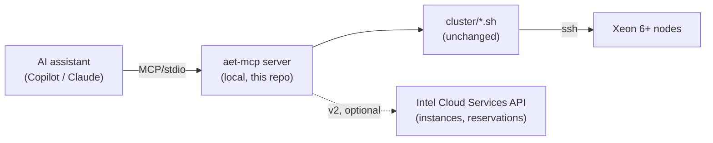

# Plan — an MCP server for the Intel® AET cloud toolkit

**Status:** draft / living document. This is a *plan*, not an implementation.
It is revised as the AI-assisted deployment trial exposes new evidence; see
[Revision log](#revision-log).

**Question it answers:** the repo already ships `AGENT.md` + `SKILLS.md` so a
generative-AI assistant can drive `cluster/*.sh` on a user's behalf. Would
wrapping that toolkit in a [Model Context Protocol](https://modelcontextprotocol.io)
server add enough value to justify building and operating one — and could it
strengthen the Intel® Cloud Services offering rather than just this demo?

---

## 1. The gap this would close

Prose instructions tell an assistant *what to run*. They cannot tell it *what is
currently true*. Every deployment session therefore begins with the assistant
reconstructing state from ad-hoc shell: parsing `~/.ssh/config`, guessing
whether a reservation is live, diffing `lscpu` output across nodes, grepping a
build log. That reconstruction is slow, inconsistent between assistants, and —
critically — **wrong in ways the user cannot see**.

The trial evidence below is not hypothetical; each item cost real time in the
first assisted run of `AGENT.md`/`SKILLS.md`.

| # | Friction observed | What the assistant had to do | Tool that would have answered it |
|---|-------------------|------------------------------|----------------------------------|
| 1 | Prior allocation had expired, but its `~/.ssh/config` stanzas remained and looked healthy | ad-hoc `ssh` probes; then hit an unanswerable jump-host password prompt | `allocation.status` → `EXPIRED` |
| 2 | `-o BatchMode=yes` is not inherited by the `ProxyJump` child, so scripts hung on a password prompt | three experiments to find `setsid` as the workaround | `ssh.check` returning typed `STALE` per alias |
| 3 | No way to confirm four delivered nodes were one SKU | read `00-probe.sh` source, then add a homogeneity check to it | `nodes.inventory` → CPU model per node + `homogeneous: bool` |
| 4 | `ncat` absent, so the generated `ProxyCommand` would have been broken | `command -v` spot-checks | `workstation.preflight` → per-tool availability |
| 5 | Reservation duration vs. kernel-build time had no documented relationship | read the build script to discover `capture` needs a live node | `kernel.build.plan` → phase durations vs. `reservation_end` |
| 6 | Kernel build is detached; state lives in a pidfile + log | read the script to learn `build-status` exists | `kernel.build.status` → `RUNNING`/`FAILED` + tail |

**Thesis.** The scripts are already good imperative *actions*. What is missing
is a typed, machine-readable *state surface*. MCP is a reasonable fit precisely
because it separates the two: tools for actions, resources for state.

> Counter-thesis to keep honest: most of the above were fixed by *improving the
> scripts and docs*, at far lower cost than an MCP server. The plan must show
> value that better shell cannot deliver — see §6.

---

## 2. Scope

**In scope (v1):** a local MCP server, shipped in this repo, that exposes the
existing `cluster/*.sh` toolkit as typed tools + resources over stdio, for an
assistant running on the user's workstation.

**Out of scope (v1):** anything that talks to the Intel Cloud Services control
plane (requesting/extending/releasing instances). No such API is known to the
authors — the allocation is requested through the console's **Request a Cloud
Instance** form and approved by a human, with a 1–2 business day turnaround. Any
automation here would depend on an API that does not demonstrably exist yet;
see §5 and §7.

**Non-goals:** replacing the shell scripts (the server calls them; they remain
runnable by hand), replacing `AGENT.md`/`SKILLS.md` (they become the server's
prompt content), and hiding what is happening from the user.

---

## 3. Proposed surface

### 3.0 How state actually works in MCP (and what that forces on this design)

MCP is JSON-RPC 2.0 between a host (the assistant) and a server, typically over
stdio. It defines three server primitives — **tools** (model-invoked actions),
**resources** (application-controlled data addressed by URI), and **prompts** —
and **no persistence layer whatsoever**. There is no database, no session store,
and nothing the server remembers between calls unless we build it.

A resource is therefore **not stored state**: the client issues
`resources/read` with a URI and the server *computes and returns the contents at
read time*. So `aet://ssh/state` is a function, not a record. Ground truth stays
exactly where it already lives:

| State | Ground truth (unchanged by this plan) | Derived by |
|-------|----------------------------------------|------------|
| allocation liveness | the nodes + the console | an actual SSH attempt (`01-ssh-config.sh check`) |
| SSH stanzas | `~/.ssh/config` | parsing it, plus `ssh -G` |
| cluster description | `cluster/inventory.env` | parsing + `validate_inventory` |
| node capability / SKU | the nodes themselves | `00-probe.sh` over SSH |
| kernel build | build pidfile + log in `$AET_RUNDIR` | `20-kernel-build.sh build-status` |
| cluster + telemetry | the k3s API and Prometheus | `30-k3s-up.sh status`, `40-deploy-telemetry.sh verify` |

The protocol does offer optional change signalling — `resources/subscribe` with
`notifications/resources/updated`, and `listChanged` for the resource list — but
those only tell a client to re-read. They are not storage. For a long-running
kernel build or a k3s rollout they are the natural fit, and worth declaring the
`subscribe` capability for; everything else can be plain read-on-demand.

**Two kinds of validation, and only one is free.**

1. *Schema validation* — what MCP provides. Every tool declares an
   `inputSchema` (JSON Schema) and may declare an `outputSchema`; structured
   results are returned in `structuredContent`. The spec requires servers to
   validate all tool inputs and all resource URIs, requires structured results
   to conform to a declared output schema, and has clients validate them in
   turn. This is a genuine gain over scraping shell stdout — but it only proves
   the JSON has the right *shape*.
2. *Semantic validation* — whether the answer is **true of the machine right
   now**. MCP provides nothing here. A schema-valid `{"state": "LIVE"}` can
   describe a node that died an hour ago. This is the validation that matters
   for us, and it can only come from the evidence-gathering the scripts already
   do.

**Design rules that follow.** These are the load-bearing part of this section:

- **Stateless by default; derive on read.** The server holds no authoritative
  copy of anything. If the process is restarted mid-deployment, nothing is lost.
- **Never cache truth about someone else's machine.** A reservation can expire,
  a node can reboot, another operator can run `kubectl` — none of which the
  server observes. Caching is permitted only as a latency optimisation, with a
  short TTL and an explicit bypass.
- **Every result carries `as_of` and `evidence`.** A timestamp and the command
  that produced it, so the assistant can reason about staleness and the user can
  reproduce the claim by hand. An assistant that cannot tell fresh from stale
  will confidently act on stale.
- **Distinguish "false" from "unknown".** `sku_homogeneous: false` and
  "two nodes were unreachable so I cannot tell" are different answers, and
  conflating them is how a mixed-SKU cluster gets built anyway. Prefer an
  explicit `unknown` over a defaulted boolean.
- **Preconditions are re-checked at call time, not trusted from an earlier
  read.** This is what makes the §5 safety gates real rather than advisory.

### 3.1 Resources (read-only state)

Resources are the main value: they are cheap, safe, cacheable, and let an
assistant orient itself without running anything mutating.

| URI | Contents |
|-----|----------|
| `aet://workstation/preflight` | `ssh`/`git`/`docker`/`nc`/`ncat`/`setsid` presence, docker daemon reachability, proxy env, outbound egress |
| `aet://inventory` | parsed `inventory.env` + validation verdicts (exactly one node) |
| `aet://ssh/state` | per-alias `LIVE`/`STALE`/`UNREACHABLE`/`NO-STANZA`/`HOSTKEY`, managed-block presence, shadowing stanzas |
| `aet://nodes/probe` | `00-probe.sh` as structured JSON: the node's CPU model, kernel, sudo, RAPL, AET config, egress |
| `aet://kernel/build` | detached build state: running, exit code, log tail, produced `.deb`, verified symbols |
| `aet://cluster/state` | k3s node list, labels, telemetry pod status |
| `aet://telemetry/health` | Prometheus target health + whether AET/RAPL series are live |
| `aet://stage` | **derived**: which of the 11 skills is satisfied, and the single next action |

`aet://stage` is the one an assistant should read first, and the one prose can
never provide.

### 3.2 Tools (actions)

Thin, typed wrappers over existing subcommands. Each returns structured results,
not scraped stdout.

| Tool | Wraps | Mutating |
|------|-------|----------|
| `ssh_config_apply` / `ssh_config_remove` / `ssh_config_prune` | `01-ssh-config.sh` | yes (backs up) |
| `probe_nodes` | `00-probe.sh` | no |
| `proxy_setup` | `05-proxy-setup.sh` | yes |
| `kernel_build_start` / `kernel_build_status` / `kernel_verify` | `20-kernel-build.sh` | yes |
| `kernel_install` / `kernel_oneshot` / `kernel_promote` | `21-kernel-install.sh` | yes — **reboot-gated** |
| `k3s_up` / `k3s_status` | `30-k3s-up.sh` | yes |
| `telemetry_deploy` / `telemetry_verify` | `40-deploy-telemetry.sh` | yes |
| `validate_snapshot` / `validate_query` | `60-validate.sh` | no |
| `grafana_tunnel_up` / `status` / `down` | `70-grafana-tunnel.sh` | yes |

### 3.3 Prompts

`SKILLS.md` entries become MCP prompts (`skill/1b-ssh-config`, `skill/4-kernel`,
…), so an assistant loads only the skill it needs instead of the whole file.

---

## 4. Architecture

- **Local, stdio, in-repo.** No service to operate, no new attack surface beyond
  what the user already runs. Ships and versions with the scripts it wraps.
- **Scripts stay authoritative.** The server shells out; it must never
  reimplement logic, or the two drift and hand-runs stop matching assisted runs.
- **Language:** Python (already required by the toolkit) or Go (single static
  binary, no venv on the user's workstation). Decide in §7.

---

## 5. Safety model

The existing safety rules in `AGENT.md` are prose an assistant may ignore. As
MCP tool metadata they become *enforceable*:

- Every tool declares `readOnlyHint` / `destructiveHint`; state resources are
  strictly read-only.
- Reboot-capable tools (`kernel_oneshot`, `kernel_promote`) require an explicit
  `allow_reboot: true` argument **and** a recorded confirmation that an
  out-of-band recovery path exists — the `ALLOW_REBOOT=1` gate, made structural.
- `ssh_config_prune` and any delete require an explicit target list; no
  wildcards. Backups always taken, path returned in the result.
- The server never handles credentials. SSH keys stay in `~/.ssh`; it invokes
  `ssh` and inherits the user's agent/config. No secret ever crosses the model
  context.
- Ordering invariants encoded as preconditions, so a tool call that would
  violate them fails fast with the reason: `kernel_promote` refuses unless a
  one-shot boot on that node was observed healthy. Per §3.0 these are re-checked
  against the node at call time — never inferred from an earlier resource read,
  which may describe a machine that has since rebooted.
- Tool `annotations` (including `destructiveHint`) are advisory metadata that
  clients are told to distrust from untrusted servers. They improve the host's
  UX; they are not the enforcement mechanism. Enforcement is the server refusing
  the call.

This is the strongest argument for the MCP layer: **safety rules that are
currently advisory become mechanical.**

---

## 6. Value proposition for Intel® Cloud Services

Honest assessment, to be revised as evidence accumulates.

**Where it is genuinely additive**
- *Self-service onboarding.* "Rent a Xeon 6+ node and see per-Pod energy in
  Grafana" becomes a guided flow with a machine-checkable definition of done at
  every stage. That lowers the support cost of a differentiating feature.
- *Consistency across assistants.* Typed state means Copilot, Claude, and an
  internal agent behave the same. Prose does not guarantee that.
- *Enforceable guardrails on rented hardware.* Reboot gating and recovery-path
  confirmation matter more, not less, when the machine is someone else's.
- *Telemetry-native queries.* `validate_query` over live Prometheus turns
  "compare the energy of these two workloads" into something an assistant can
  actually answer, which is the product's whole point.
- *A template.* If this pattern works, other Intel Cloud recipes (Gaudi,
  confidential compute) get the same treatment. The reusable asset is the
  *pattern*, not this server.

**Where the value is weak or unproven**
- Most trial friction was fixable in shell + docs, at a fraction of the cost.
  An MCP server that only re-exposes those fixes is redundant.
- Value concentrates in the *stateful, long-running, multi-day* parts
  (reservation windows, detached builds, reboot cycles). A short single-node
  demo barely benefits.
- Without a Cloud Services API for instances, the most painful step of all
  (request an allocation and wait 1–2 business days for human approval) stays
  manual, and the server cannot close the loop. As far as we know today, no such
  API exists — the console form is the only path. **This caps the achievable
  value: the server can manage everything from "nodes are `Ready`" onward, and
  nothing before it.** If Intel Cloud Services were to expose even a read-only
  reservation endpoint (state, `Reservation End`, instance type), the
  `allocation.status` answer proposed for friction item #1 in §1 becomes
  possible, and expiry-driven failures become impossible rather than merely
  well-diagnosed.
- Maintenance: a second interface over the same scripts is a drift risk.

**Sharpest formulation.** The value is *not* "run the scripts for you" — the
assistant can already do that. It is **"know, reliably and cheaply, what is
currently true, and refuse to do the dangerous thing at the wrong moment."**
If a phase does not advance that, cut it.

---

## 7. Phasing

| Phase | Deliverable | Decides |
|-------|-------------|---------|
| 0 | This document + friction log kept current through the trial | whether the evidence justifies phase 1 |
| 1 | Read-only server: `workstation/preflight`, `inventory`, `ssh/state`, `nodes/probe`, `stage` | does typed state measurably shorten a session? |
| 2 | Non-destructive tools + prompts from `SKILLS.md` | do assistants follow typed preconditions better than prose? |
| 3 | Mutating tools with structural safety gates (reboot, prune, deploy) | are the guardrails actually enforceable end to end? |
| 4 | *Blocked:* Cloud Services control-plane integration (request / extend / release / instance-type catalog) | no known public API; the console form is human-approved. Treat as a **request to the Cloud Services product team**, not a work item here |

Phase 1 is the cheap, falsifiable experiment: build it, run the same deployment
with and without it, compare turns-to-completion and number of wrong turns.

Because phase 4 is blocked, phases 1–3 must stand on their own merits. They do:
every friction item in §1 except the allocation request itself lives after the
nodes are `Ready`.

---

## 8. Open questions

1. ~~Is there a public/partner Intel Cloud Services API for instances and
   reservations?~~ **Answered 2026-08-11: none known.** The repo author has only
   ever used the manual console form. Phase 4 is therefore blocked on a product
   decision by Cloud Services, and the ask should be framed as "expose
   reservation state read-only" — the cheapest change with the largest effect on
   this plan.
2. Does an MCP server actually reduce assistant error rate versus the improved
   `AGENT.md`/`SKILLS.md`, or does it mostly reduce latency? Needs the phase-1
   A/B.
3. Where does the server run for a *published* demo — user workstation only, or
   also alongside a bastion so a customer can drive it without local setup?
4. Python or Go? Go removes a venv/runtime dependency from the user's
   workstation; Python matches the existing toolchain.
5. ~~Should `inventory.env` remain the source of truth, or should the server own
   allocation state?~~ **Settled by §3.0: `inventory.env` remains ground truth
   and the server stays stateless.** The remaining sub-question is narrower —
   is there any state with no natural home on disk today (e.g. "this node's
   one-shot boot was observed healthy", which `kernel_promote` must check)? If
   so it belongs in a file the scripts also read, not in server memory.
6. Multi-tenancy: is this ever more than one user driving one allocation?

---

## Revision log

| Date | Change | Evidence |
|------|--------|----------|
| 2026-08-11 | Initial draft | First assisted-deployment trial: expired-allocation detection, `ProxyJump`/`BatchMode` hang, SKU homogeneity, missing `ncat`, reservation-vs-build-window coupling, detached build state |
| 2026-08-11 | Phase 4 reclassified speculative → blocked; open question 1 answered | No known instance/reservation API; the console form is the only path, human-approved with a 1–2 business day turnaround |
| 2026-08-11 | Added §3.0 state model | Review question: "how is state stored and validated?" MCP has no persistence layer — resources are computed on read — and provides schema validation only, not semantic validation. Recorded the derive-on-read rules that follow |
